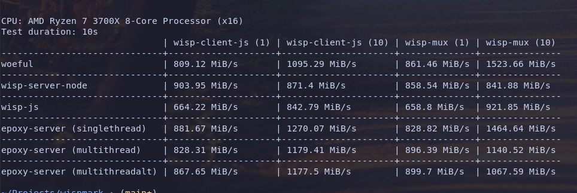

# Woeful
A [Wisp](https://github.com/MercuryWorkshop/wisp-protocol) server that might not suck.

# Features
- Wisp V1 Support
- Pcap network capture

# Is it fast?
It's faster the [WispServerCpp](https://github.com/FoxMoss/WispServerCpp/). 
The other benchmarks are more nuanced.

# Is it stable?
Maybe? It's C++ so I'm cautious to encourage you to use it over something like [Epoxy](https://github.com/MercuryWorkshop/epoxy-tls) with the safety of Rust. More testing is needed, and I'll be the first to admit it.

# Dependencies
Big thanks to all of these projects:
- [uWebSockets](https://github.com/uNetworking/uWebSockets) A high performant web socket server library.
- [Cli11](https://github.com/CLIUtils/CLI11.git) for configuration.
- [pugixml](https://github.com/leethomason/tinyxml2) for xml configuration.
- [tl::expected](https://github.com/TartanLlama/expected) a polyfill for the c++23 feature for better error handling.
- [PcapPlusPlus](https://github.com/seladb/PcapPlusPlus.git) for recording traffic going through your wisp server.
- [BS_thread_pool](https://github.com/bshoshany/thread-pool) a basic thread pool library.

# Why rewrite WispServerCpp?
WispServerCpp is an unstable buggy project I wrote in a vacuum before much of the Wisp ecosystem existed, this is my attempt to make a Wisp server that can actually perform at high speeds and with varied traffic.
